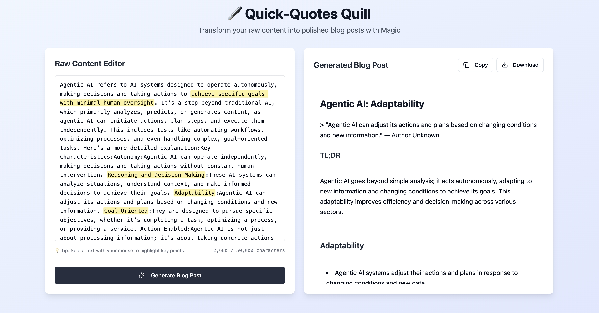

# 🖋️ Quick-Quotes Quill

[](https://quick-quotes-quill.lovable.app/)

**[Try the Live Demo!](https://quick-quotes-quill.lovable.app/)**



Transform your raw notes, transcripts, or interview recordings into polished, ready-to-publish blog posts in seconds! ⚡️ Just paste your content, **highlight the key themes**, and let our AI-powered quill do the writing for you.

## ✨ Features

-   **📝 Smart Text Editor**: Paste any amount of raw text. Our editor is designed to handle large inputs smoothly.
-   **🎯 Highlight-to-Guide**: Simply select the most important parts of your text to guide the AI.
-   **🤖 AI-Powered Generation**: Uses the Gemini API to generate a well-structured and coherent blog post based on your highlighted themes.
-   **💾 Optional Database Integration**: Saves your work automatically to a Supabase backend if configured.
-   **📋 Easy Export**: Copy the generated markdown to your clipboard or download it as a `.md` file.
-   **🎨 Sleek UI**: Built with React, Vite, and shadcn/ui for a modern and responsive experience.

## 🚀 Getting Started

Ready to start generating content? Follow these simple steps to get the project running locally.

### Prerequisites

-   [Node.js](https://nodejs.org/en) (v18 or higher)
-   [npm](https://www.npmjs.com/) (usually comes with Node.js)
-   A Google AI [Gemini API key](https://aistudio.google.com/app/apikey).
-   A Supabase account and a project (Optional).

### Installation

1.  **Clone the repo**
    ```sh
    git clone <YOUR_GIT_URL>
    cd quick-quotes-quill
    ```

2.  **Install dependencies**
    ```sh
    npm install
    ```

3.  **Set up your environment variables & Supabase CLI**
    -   Copy the example `.env.example` file to a new `.env` file:
        ```sh
        cp .env.example .env
        ```
    -   Add your API credentials to the `.env` file. (See next section for details).
    -   **Important:** Open `supabase/config.toml` and replace the existing `project_id` with your own Supabase project ID. This is required to use the Supabase CLI to manage your database migrations.
        ```toml
        # supabase/config.toml
        project_id = "your-new-project-id" # <-- Update this line
        ```

4.  **Run the development server**
    ```sh
    npm run dev
    ```

Your app should now be running on `http://localhost:8080`!

## 🛠️ Environment Variables

To run the application, you need to provide the following environment variables in a `.env` file at the project root.

The Supabase variables are optional. If they are not provided, the application will still function, but your work will not be saved to a database.

| Variable                    | Description                                                   |
| --------------------------- | ------------------------------------------------------------- |
| `VITE_GEMINI_API_KEY`       | Your API key for the Google Gemini service. **(Required)** |
| `VITE_SUPABASE_URL`         | Your Supabase project URL. (Optional)                        |
| `VITE_SUPABASE_ANON_KEY`    | Your Supabase project's public "anon" key. (Optional)        |


You can find the Supabase keys in your project's "API Settings".

## 🤝 Contributing

Contributions are what make the open-source community such an amazing place to learn, inspire, and create. Any contributions you make are **greatly appreciated**.

Please see our **[Contributing Guide](./CONTRIBUTING.md)** for more details on our code of conduct and the process for submitting pull requests.

## 📄 License

Distributed under the MIT License. See `LICENSE` for more information.